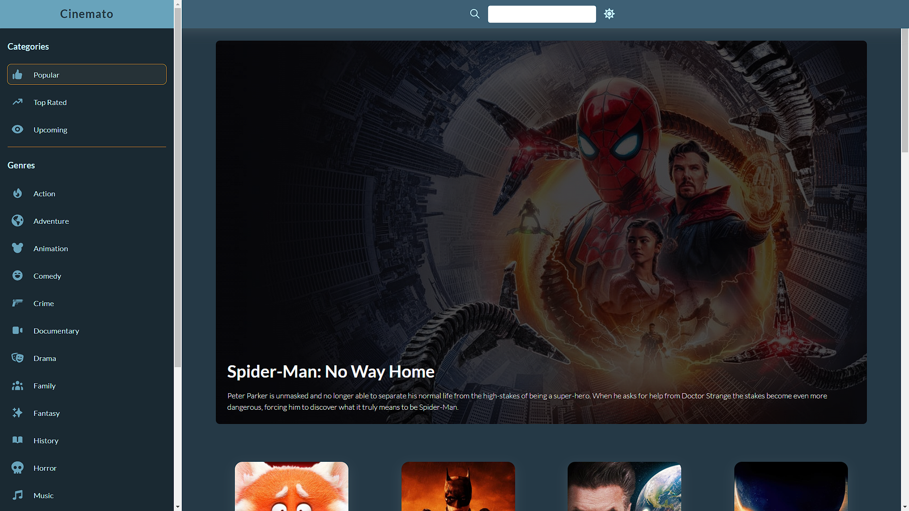
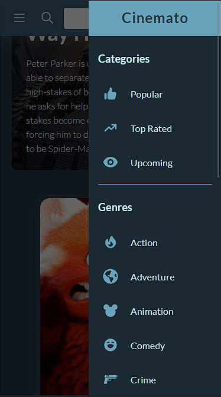

# CINEMATO

## Description

Cinemato is a database search app with information related to films. Find all about your favorite movies and actors filtered by categories, genres, and search terms.

## Getting Started

### Built with

- HTML5
- CSS3
- JS
- React

### Dependencies

- React v.17.0.2
- React Icons v.4.3.1
- React Router v.6.3.0

### Installation

In the project directory, you can run:

- Clone this project in your local machine
- npm install: Install dependencies
- npm start: Runs the app in the development mode

## Screenshots

- Desktop

- Mobile

## Links

[live Site URL](https://cinemato.netlify.app)

## Authors

[@sanramu93](https://github.com/sanramu93)

## Version History

- 0.1
  - Initial Release

## License

This project is licensed under the [MIT] License - see the LICENSE.md file for details
